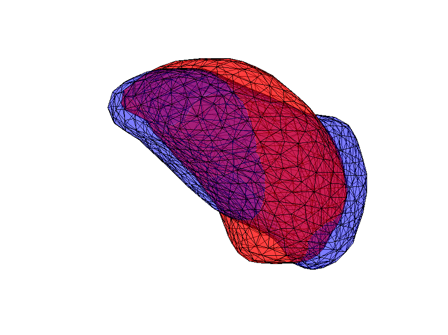
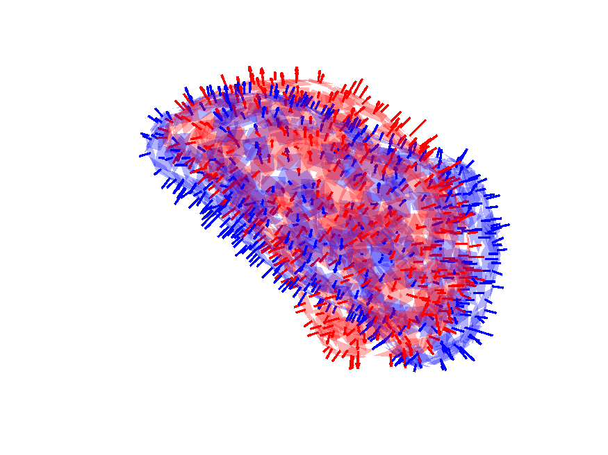

# Var_LDDMM

This is a MATLAB implementation of the papers [Diffeomorphic Registration of Discrete Geometric Distributions](https://www.worldscientific.com/doi/abs/10.1142/9789811200137_0003) and [Metrics, quantization and registration in varifold spaces](https://arxiv.org/abs/1903.11196) by Hsi-Wei Hsieh and [Nicolas Charon](http://www.cis.jhu.edu/~charon/). The package provides tools to register, intepolate and compress geometrical shapes (such as point clouds, discrete cruves or triangulated surfaces) being represented as ***discrete varifolds*** based on ***LDDMM*** framework with ***kernel varifold distances***. Here's an example of amygdala surfaces matching example.

<table align='center'>
<tr align='center'>
<td> Amygdala surfaces</td>
<td> Varifold representation</td>
</tr>
<tr>
<td>
<td>
</tr>
</table>

## References
If you use this code for your research, please cite our papers:

```
@article{hsieh2019diffeomorphic,
  title={Diffeomorphic Registration of Discrete Geometric Distributions},
  author={Hsieh, Hsi-Wei and Charon, Nicolas},
  journal={Mathematics Of Shapes And Applications},
  volume={37},
  pages={45},
  year={2019},
  publisher={World Scientific}
}

@article{hsieh2019metrics,
  title={Metrics, quantization and registration in varifold spaces},
  author={Hsieh, Hsi-Wei and Charon, Nicolas},
  journal={arXiv},
  pages={arXiv--1903},
  year={2019}
}
```

## Set up
To run functions without GPU acceleration, it only requires MATLAB and [HANSO](https://cs.nyu.edu/overton/software/hanso/) library for L_BFGS optimization. We have put HANSO in the folder `/src/optimization/`.

Basic dependencies:
* MATLAB
* [HANSO version 2.2](https://cs.nyu.edu/overton/software/hanso/): in `/src/optimization/`

Var_LDDMM also includes GPU acceleration implementations using [KeOps](https://www.kernel-operations.io/keops/matlab/index.html) library (libkeops-master in folder '/src/'). It must be used on a machine equipped with an NVIDIA graphics card with recent CUDA drivers installed.

Optional dependencies (GPU acceleration):
* [KeOps](https://www.kernel-operations.io/keops/matlab/index.html): libkeops-master in folder '/src/' 

## Usage
