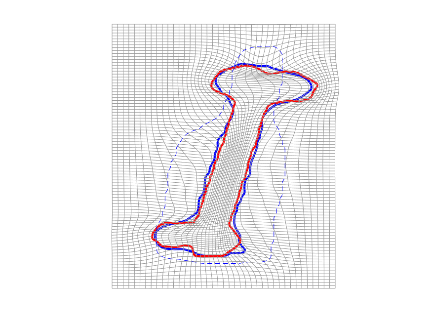

# Var_LDDMM

This is a MATLAB implementation of the papers [Diffeomorphic Registration of Discrete Geometric Distributions](https://www.worldscientific.com/doi/abs/10.1142/9789811200137_0003) and [Metrics, quantization and registration in varifold spaces](https://arxiv.org/abs/1903.11196) by Hsi-Wei Hsieh and [Nicolas Charon](http://www.cis.jhu.edu/~charon/). The package provides tools to register, intepolate and compress geometrical shapes (such as point clouds, discrete cruves or triangulated surfaces) being represented as ***discrete varifolds*** based on ***LDDMM*** framework with ***kernel varifold distances***. 

## References
If you use this code for your research, please cite our papers:

```
@article{hsieh2019diffeomorphic,
  title={Diffeomorphic Registration of Discrete Geometric Distributions},
  author={Hsieh, Hsi-Wei and Charon, Nicolas},
  journal={Mathematics Of Shapes And Applications},
  volume={37},
  pages={45},
  year={2019},
  publisher={World Scientific}
}

@article{hsieh2019metrics,
  title={Metrics, quantization and registration in varifold spaces},
  author={Hsieh, Hsi-Wei and Charon, Nicolas},
  journal={arXiv},
  pages={arXiv--1903},
  year={2019}
}
```

## Set up
To run functions without GPU acceleration, it only requires MATLAB and [HANSO](https://cs.nyu.edu/overton/software/hanso/) library for L_BFGS optimization. We have put HANSO in the folder `/src/optimization/`.

Basic dependencies:
* MATLAB
* [HANSO version 2.2](https://cs.nyu.edu/overton/software/hanso/): in `/src/optimization/`

Var_LDDMM also includes GPU acceleration implementations using [KeOps](https://www.kernel-operations.io/keops/matlab/index.html) library (libkeops-master in folder '/src/'). It must be used on a machine equipped with an NVIDIA graphics card with recent CUDA drivers installed.

Optional dependencies (GPU acceleration):
* [KeOps](https://www.kernel-operations.io/keops/matlab/index.html): libkeops-master in folder '/src/' 

## Usage
### Registration:
We implemented *geodesic shooting* framework and in this framework, the optimization in LDDMM is minimize the cost function with respect to the ***momenta*** variables.  
Use `registration` function for LDDMM varifolds matching algorithm:
```Matlab
[P_op,summary]= registration(Source,Target,defo,objfun,options)
```
- Input:
  - `Source`/`Target`: source/target shape represented as a discrete varifold (structure):
    - `Source.center`: a `N-by-m` array contains positions of `N` diracs in dimension `m` 
    - `Source.vector`: a cell array with length `d` carries a frame for the grassmanian, each entry `Source.vector{i}` is a `N-by-m` array
  - `defo`: options for deformation and numerical ODE:
    - `defo.kernel_size_mom`: deformation kernel size
    - `defo.nb_euler_steps`: number of steps in the forward and backward integration
    - `defo.odemethod`: numerical scheme for ODE, possible values: `'rk4'` or `'middle_point'`
    - `defo.method`: compute kernel operation in deformation using only matlab or GPU with keops, possible values: `'keops'` or `'matlab'`

  - `objfun`: options for varifold data attachment term:
    - `objfun.kernel_geom`: spatial kernel type, possible values:`'gaussian'` or `'cauchy'`
    - `objfun.kernel_size_geom`: spatial kernel sizes in an array `[a_1,...,a_K]`, successively runs K times optimizations with kernel sizes `a_1,...,a_K`, and each optimization uses momemta from previous step as initials. The length of the array should be consistant with `kernel_size_grass`
    - `objfun.kernel_grass`: Grassmanian/orientation kernel type, possible values: `'linear'`, `'gaussian_oriented'`, `'gaussian_unoriented'`, `'binet'`
    - `objfun.kernel_size_grass`: Grassmanian/orientation kernel sizes in an array `[b_1,...,b_K]`
    - `objfun.method`='keops': compute kernel operation in data attachment term using only matlab or GPU with keops, possible values: `'keops'` or `'matlab'`
    - `objfun.lambda`: weight parameter in front of the data attachment term

  - `options`: options for L-BFGS:
    - `options.record_history`: `true` or `false`
    - `options.maxit`: max number of iterations(default `1000`) (applies to each starting vector)
    - `options.nvec`: `0` for full BFGS matrix update, otherwise specifies number of vectors to save and use in the limited memory updates (default: `0`)
    - `options.prtlevel`: one of `0` (no printing), `1` (minimal), `2` (verbose) (default: `1`)

- Output:
  - `P_op`: the optimized momenta stored in a structure
  - `summary`: summary of the optimization

### Compression/Quantization:
Use the function `proj2_M_dirac` to compress a discrete varifold to a more sparse discrete varifold with `M` diracs:  
```Matlab
[Y,summary] = proj2_M_dirac(X,X_ini,objfun,options)
```
- Input:
  - `X`: full discrete varifold to be compressed
  - `X_ini`: initial discrete varifold with `M` diracs
  - `objfun` and `options`: same as in `registration`, the field `objfun.lambda` is not needed in compression.
- Output:
  - `Y`: compressed varifold
  - `summary`: summary of the optimization
  
### Examples:
See the two script files in the `Demo scripts` folder for some examples of basic use of the code. The first script `script_Bone_Bottle_quantization_registration.m` computes the successive compressions and registrations of two curves.
<table align='center'>
<tr align='center'>
<td> Relative quantization errors </td>
<td> M=25</td>
<td> M=40</td>
<td> M=150</td>
</tr>
<tr>
<td>
<td>
<td>
<td>
</tr>
<tr>
<td> Difference to thegroundtruth optimal energy </td>
<td> M=25</td>
<td> M=40</td>
<td> M=150</td>
</tr>
<tr>
<td>
<td>
<td>
<td>
</tr>
</table>

The second script `script_amygdala.m` register two amygdala surfaces using GPU acceleration:
<table align='center'>
<tr align='center'>
<td> Amygdala surfaces</td>
<td> Varifold representation</td>
</tr>
<tr>
<td>
<td>
</tr>
</table>

## Licence

This program is free software: you can redistribute it and/or modify it under 
the terms of the GNU General Public License as published by the Free Software 
Foundation, either version 3 of the License, or (at your option) any later 
version.

This program is distributed in the hope that it will be useful, but WITHOUT 
ANY WARRANTY; without even the implied warranty of MERCHANTABILITY or FITNESS 
FOR A PARTICULAR PURPOSE. See the GNU General Public License for more details.

You should have received a copy of the GNU General Public License along with 
this program. If not, see http://www.gnu.org/licenses/.


## Contacts

* Nicolas Charon (charon@cis.jhu.edu)
* Hsi-Wei Hsieh (hhsieh9@jhu.edu)
