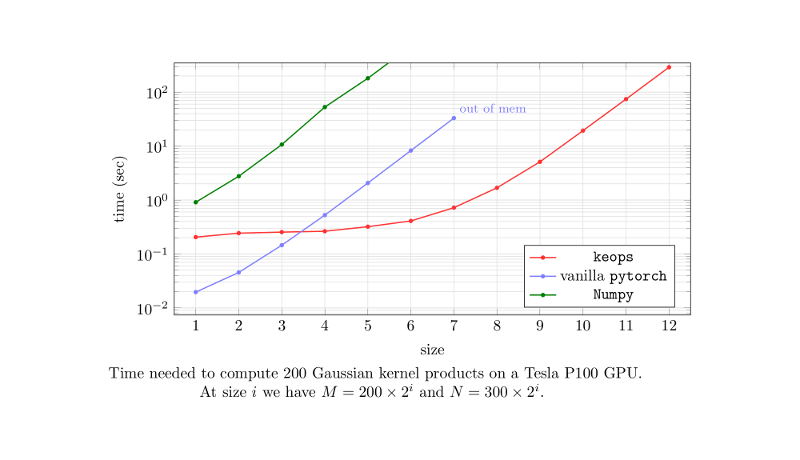

```
      88         oooo    oooo             .oooooo.                               88
    .8'`8.       `888   .8P'             d8P'  `Y8b                            .8'`8.
   .8'  `8.       888  d8'     .ooooo.  888      888 oo.ooooo.   .oooo.o      .8'  `8.
  .8'    `8.      88888[      d88' `88b 888      888  888' `88b d88(  "8     .8'    `8.
 .8'      `8.     888`88b.    888ooo888 888      888  888   888 `"Y88b.     .8'      `8.
.8'        `8.    888  `88b.  888    .o `88b    d88'  888   888 o.  )88b   .8'        `8.
88oooooooooo88   o888o  o888o `Y8bod8P'  `Y8bood8P'   888bod8P' 8""888P'   88oooooooooo88
                                                       888
                                                      o888o
```

# What is KeOps?

KeOps is a [cpp/cuda library](./keops) that comes with bindings in [python](https://plmlab.math.cnrs.fr/benjamin.charlier/libkeops/wikis/python/Documentation) (numpy and pytorch), [Matlab](https://plmlab.math.cnrs.fr/benjamin.charlier/libkeops/wikis/matlab/generic-syntax) or R (coming soon). KeOps computes efficiently **Kernel dot products**, **their derivatives** and **other similar operations** on the GPU. It provides good performances and linear (instead of quadratic) memory footprint through a minimal interface.

In short: *KErnel OPerationS, on CPUs and GPUs, with autodiff and without memory overflows*.

# Installing KeOps and getting started

The core of KeOps relies on a set of **C++/CUDA routines**. for which we provide bindings in the following languages

- **Python**: [installation instructions](https://plmlab.math.cnrs.fr/benjamin.charlier/libkeops/wikis/python/Installation) and [examples](./pykeops/examples)
  + **numpy**: [doc](https://plmlab.math.cnrs.fr/benjamin.charlier/libkeops/wikis/python/Documentation)
  + **pytorch**: [doc](https://plmlab.math.cnrs.fr/benjamin.charlier/libkeops/wikis/python/Documentation) and [tutorials](./pykeops/tutorials)
- **MATLAB**:  [installation instructions](https://plmlab.math.cnrs.fr/benjamin.charlier/libkeops/wikis/matlab/Installation) and [examples](./keopslab/examples)
- **R**: coming soon...

# Why using KeOps?

## Scalable kernel operations

The very first motivation for KeOps was to compute fast and scalable Gaussian convolutions (aka. **RBF kernel product**). Given:

- a target point cloud $`(x_i)_{i=1}^N \in  \mathbb R^{N \times D}`$
- a source point cloud $`(y_j)_{j=1}^M \in  \mathbb R^{M \times D}`$
- a signal or vector field $`(b_j)_{j=1}^M \in  \mathbb R^{M \times E}`$ attached to the $`y_j`$'s

we strive to compute efficiently the array $`(a_i)_{i=1}^N \in  \mathbb R^{N \times E}`$ given by

```math
 a_i =  \sum_j K(x_i,y_j) b_j,  \qquad i=1,\cdots,N
```

where $`K(x_i,y_j) = \exp(-\|x_i - y_j\|^2 / \sigma^2)`$. Another useful quantity that we need to compute is the derivative of $`a_i`$ with respect to the $`x_i`$'s,

```math
 a_i' =  \sum_j K'(x_i,y_j) b_j,  \qquad i=1,\cdots,N
```

where $`K'(x_i,y_j) = \partial_x \exp(-\|x_i - y_j\|^2 / \sigma^2)`$. KeOps allows you to compute
both $`a_i`$ and $`a_i'`$ efficiently with its automatic differentiation module - that is, without needing to code explicitly the formula $`K'(x_i,y_j) = -2(x_i - y_j) \exp(-\|x_i - y_j\|^2 / \sigma^2)`$.

**Today, KeOps can be used on a broad class of formulas** as explained [below](#abcd).

## High performances

In recent years, Deep Learning frameworks such as
[Theano](http://deeplearning.net/software/theano/), [TensorFlow](http://www.tensorflow.org) 
or [PyTorch](http://pytorch.org) have evolved
into fully-fledged applied math libraries:
With negligible overhead, these tools now bring **automatic differentiation**
and **seamless GPU support** to research communities used
to array-centric frameworks -- Matlab and numpy.

Unfortunately, though, *no magic* is involved:
optimised CUDA codes still have to be written
for every atomic operation provided to end-users, and
supporting all the standard mathematical computations
thus comes at a **huge engineering cost** for the developers
of the main frameworks.
As of 2018, this considerable effort has been mostly restricted to the
operations needed to implement Convolutional Neural Networks:
linear algebra routines and *grid* convolutions.
**With KeOps, we are providing the brick that several research communities were missing.**

**The baseline example.**
A standard way of computing Gaussian convolutions in array-centric frameworks is to
create and store in memory the full M-by-N kernel matrix $`K_{i,j}=K(x_i,y_j)`$,
before computing $`(a_i) = (K_{i,j}) (b_j)`$ as a standard matrix product.
Unfortunately, for large datasets (say, $`M,N \geqslant 10,000`$), this becomes intractable: **large matrices just don't fit in GPU memories**.

The purpose of KeOps, simply put, is to **let users break through this memory bottleneck** by computing *online sum reductions*:



## A generic framework that fits your needs <a name="abcd"></a>

KeOps supports **generic operations**, way beyond the simple case of kernel convolutions.
Let's say that you have at hand:

- a collection $`p^1`$, $`p^2`$, ..., $`p^P`$ of vectors.
- a collection $`x^1_i`$, $`x^2_i`$, ..., $`x^X_i`$ of vector sequences, indexed by an integer $`i`$ ranging from 1 to N.
- a collection $`y^1_j`$, $`y^2_j`$, ..., $`y^Y_j`$ of vector sequences, indexed by an integer $`j`$ ranging from 1 to M.
- a vector-valued function $`f(p^1, p^2,..., x^1_i, x^2_i,..., y^1_j, y^2_j, ...)`$ on these input vectors.

Then, referring to the p's as *parameters*, the x's as *x-variables* and the y's as *y-variables*, the KeOps library allows you to compute efficiently *any* expression $`a_i`$ of the form

```math
a_i = \text{Reduction}_{j=1,...,M} \big[ f(p^1, p^2,..., x^1_i, x^2_i,..., y^1_j, y^2_j, ...)  \big], \qquad i=1,\cdots,N
```

alongside its *derivatives* with respect to all the variables and parameters.

As of today, we support:

- Summation and (online, numerically stable) LogSumExp reductions.
- Custom high-level (`"gaussian(x,y) * (1+linear(u,v)**2)"`) and low-levels (`"Exp(-G*SqDist(X,Y)) * ( IntCst(1) + Pow((U,V), 2) )"`) syntaxes to compute general formulas.
- High-order derivatives with respect to all parameters and variables.
- Non-radial kernels.

# Related projects

We're currently investigating the possibility of developing a backend relying on an optimized CUDA library such as [Tensor Comprehensions](http://facebookresearch.github.io/TensorComprehensions/introduction.html).

# Authors

- [Benjamin Charlier](http://www.math.univ-montp2.fr/~charlier/)
- [Jean Feydy](http://www.math.ens.fr/~feydy/)
- [Joan Alexis Glaunès](http://www.mi.parisdescartes.fr/~glaunes/)
